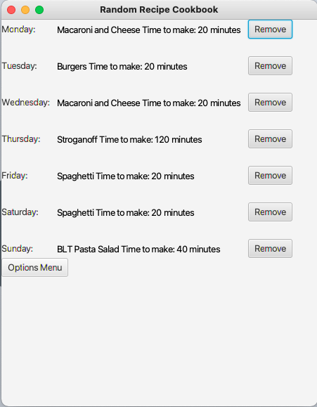

# Random Recipe Generator

## Synopsis
This program allow a user to create a collection of recipes. From that collection of recipes, the user can select a random recipe and add it to a weekly menu. 
The recipes can be filtered according to the current needs of the user.

## Motivation
This program was created to help users who struggle answering the question of "What's for dinner?" 
The program allows users to add their favorite recipes and filter them according to their weekly needs.
Users may use filters based upon weekly grocery store sales, dietary restrictions of guests, time constraints, ingredients needing to be used, or personal preference.

## How to Run
The program is written using JavaFX. It can be run in an IDE that supports JavaFX.
The test.dat file in this folder is a sample cookbook.
The test.txt file in this folder lists the details of the recipes contained within the sample cookbook.
Below are some pictures of the program running and how it works.


<br>
<em>Main Menu: This the start page of the program. To load a saved cookbook, click "Load Cookbook". To start a new cookbook click "Create Cookbook".</em>

<br>
<br>
<br>


<br>
<em>Load Cookbook: A user types in the name of the file where their cookbook is saved. 
If the typed file name is invalid, the program will close, and print out an error to the console. 
Make sure the file is in the same folder as the code!</em>

<br>
<br>
<br>


<br>
<em>Create Cookbook: After a file is loaded, or the "Create Cookbook" option is clicked, the options menu will open with the five buttons as shown.

<br>
<br>
<br>


<br>
<em>Add Recipe: When a cookbook is created, the first thing the user must do is add recipes to the cookbook. The user must type the recipe name, ethnicity, and cook time and
select the temperature of the dish. The user will then click "Add Ingredients" to start adding ingredients to the recipe.</em>

<br>
<br>
<br>


<br>
<em>Add Ingredients: The user must fill out all of the information about the ingredient they are adding. If the ingredient is a type of meat, the user should select "Protein"
for the ingredient type and check the meat box that appears. The user will click "Add", and the form will clear so that more ingredients can be added. The user must click add after each ingredient
and then click done after all the ingredients have been added.</em>

<br>
<br>
<br>


<br>
<em>Select Random Recipe: The user will decide if they want to filter ingredients. If the user clicks "No", a random recipe will generate.
If the user clicks "Yes", a list of filter options will appear.</em>

<br>
<br>
<br>


<br>
<em>Filter Options: This will display a list of ways the users can filter the recipes. The user may select as many filters as they want.</em>

<br>
<br>
<br>


<br>
<em>Filter Details: The user must type and select the details of their filter(s). Once a user clicks "Apply Filters" the filters will be applied to the cookbook.
The user must then click "Random Recipe" to get the random recipe from the filtered options.</em>

<br>
<br>
<br>


<br>
<em>Random Recipe: The random recipe will be displayed to the user, and the user can select which day to add the recipe to for the weekly menu.
The user will then have the option of selecting another random recipe or viewing the weekly menu.</em>

<br>
<br>
<br>



<br>
<em>Print Weekly Menu: The user can access the weekly menu by selecting the "View Menu" button after selecting a random recipe or by clicking the 
"Print Menu" button on the main options screen. The user can click "Remove" next to any recipe to remove the recipe from the weekly menu. 
The user can click on the "Options Menu" button to return to the options menu with the five selection buttons.</em>

<br>
<br>
<br>


<br>
<em>Save Cookbook: This will allow the user to save a cookbook. The user must type the name of the file to save. (The program uses binary input/output,
so the file should be saved with a .dat extension.) A warning will appear if the user attempts to save over the name of a previously saved cookbook.
If the user does not want to replace the cookbook, the program will assume the user wants to save the file under a different name. Once the file is saved,
the user is returned to the screen to load or create a cookbook.</em>

<br>
<br>
<br>


## Code Example
This code applies the chosen filters to the cookbook and allows the user to select a random recipe with the given filters.
```
applyBt.setOnAction(g1->{
	//Cookbook with filtered recipes
	ArrayList<Recipe>filteredMenu = menuAL;

	//Filters the recipes in the cookbook according to preferences
	if(ethnicityChk.isSelected())
		filteredMenu = ethnicityFilter(filteredMenu, recipeEthnicity.getText());

	if(timeChk.isSelected())
		filteredMenu = cookTimeFilter(filteredMenu, Integer.parseInt(recipeTime.getText()));

	if(tempChk.isSelected())
		filteredMenu = hotFilter(filteredMenu, hotRB.isSelected());

	if(ingredientChk.isSelected())
		filteredMenu = ingredientNameFilter(filteredMenu, ingredientName.getText(), removeIngRB.isSelected());

	if(typeChk.isSelected()) {
		if(typesCbo.getValue().equals("Grain"))
			filteredMenu = ingredientTypeFilter(filteredMenu, Ingredient.FoodType.Grain, removeTypeRB.isSelected());
		else if(typesCbo.getValue().equals("Vegetable"))
			filteredMenu = ingredientTypeFilter(filteredMenu, Ingredient.FoodType.Vegetable, removeTypeRB.isSelected());
		else if(typesCbo.getValue().equalsIgnoreCase("Fruit"))
			filteredMenu = ingredientTypeFilter(filteredMenu, Ingredient.FoodType.Fruit, removeTypeRB.isSelected());
		else if(typesCbo.getValue().equalsIgnoreCase("Protein"))
			filteredMenu = ingredientTypeFilter(filteredMenu, Ingredient.FoodType.Protein, removeTypeRB.isSelected());
		else if(typesCbo.getValue().equalsIgnoreCase("Dairy"))
			filteredMenu = ingredientTypeFilter(filteredMenu, Ingredient.FoodType.Dairy, removeTypeRB.isSelected());
		else if(typesCbo.getValue().equalsIgnoreCase("Fats/Sweets"))
			filteredMenu = ingredientTypeFilter(filteredMenu, Ingredient.FoodType.FatsSweets, removeTypeRB.isSelected());
	}
	if(meatChk.isSelected())
		filteredMenu = meatFilter(filteredMenu, meatCB.isSelected());

	//Buttons to generate a random Recipe
	Button randomRecipeBt = new Button("Random Recipe");
	Recipe filterRecipe = randomRecipe(filteredMenu);
	getChildren().add(randomRecipeBt);

	//Displays options for the selected random recipe
	randomRecipeBt.setOnAction(g2->{
		getChildren().clear();
		getChildren().add(new RandomRecipePane(menuAL, weeklyMenu, filterRecipe));
	});
